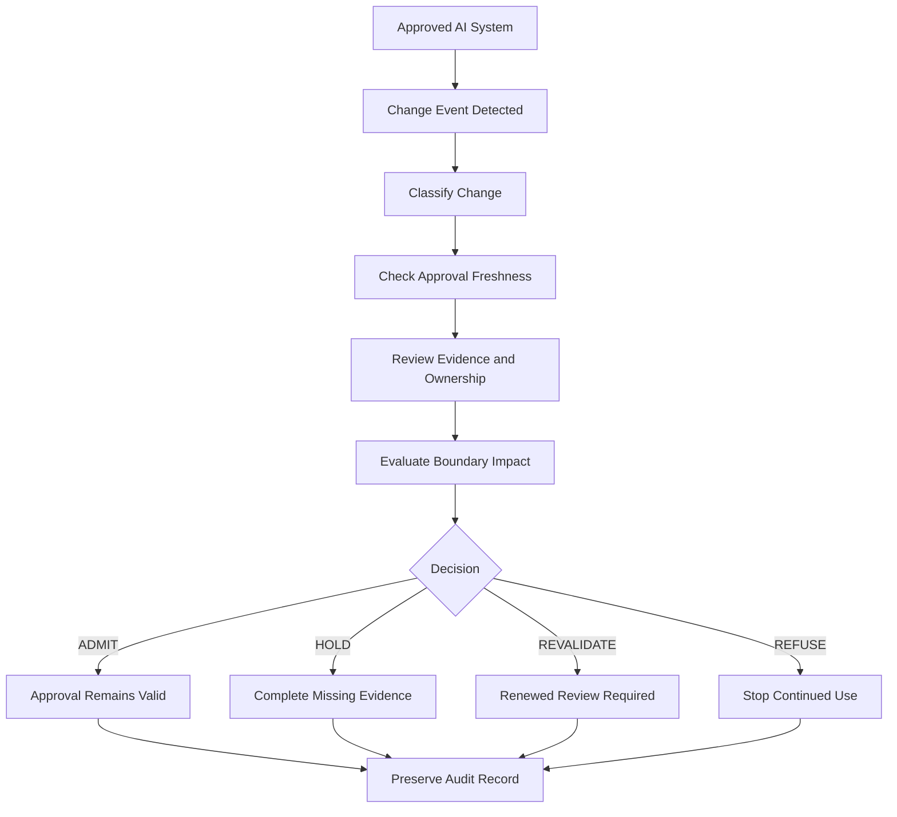

# Architecture Diagram

```mermaid
flowchart TD
    A[Approved AI System] --> B[Change Event Detected]
    B --> C[Classify Change]
    C --> D[Check Approval Freshness]
    D --> E[Review Evidence and Ownership]
    E --> F[Evaluate Boundary Impact]
    F --> G{Decision}
    G -->|ADMIT| H[Approval Remains Valid]
    G -->|HOLD| I[Complete Missing Evidence]
    G -->|REVALIDATE| J[Renewed Review Required]
    G -->|REFUSE| K[Stop Continued Use]
    H --> L[Preserve Audit Record]
    I --> L
    J --> L
    K --> L
```

## Interpretation

The revalidation engine sits between change detection and continued AI use. It prevents stale approvals from silently authorizing changed systems.
